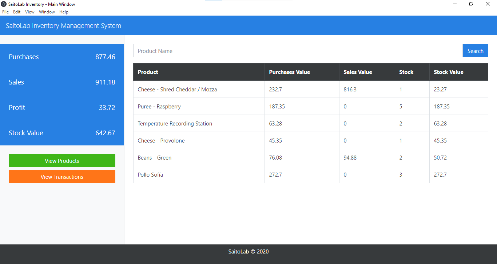

# SaitoLab Inventory Mangament System

Inventory Mangament System made with Electron and MySQL

How to contribuite:

* Clone this repository
* Make a MySQL server and in a new database import the following files:
  * `sql/saitolab_inventory_products.sql`
  * `sql/saitolab_inventory_transactions.sql`
  * `sql/saitolab_inventory_routines.sql`
  * If you like you can use the INSERT queries of `sql/insert-product.sql` to fill products table
* Copy the content of `.env.example` file in a `.env` file and write the corresponding variables of your MySQL server
* Install the dependencies: `npm install`
* And that's it

Dependencies of this project:
* [electron-forge](https://www.electronforge.io/): Complete tool for creating, publishing, and installing modern Electron applications.
* [promise-mysql](https://www.npmjs.com/package/promise-mysql): Connector for MySQL that works with Promises.
* [dotenv](https://www.npmjs.com/package/dotenv): zero-dependency module that loads environment variables from a ***.env*** file into process.env.
* [moment](https://momentjs.com/): Parse, validate, manipulate, and display dates and times in JavaScript.